# УВП — Система Управления Временем Проектов

## Описание

УВП — современная веб-платформа для управления проектами, задачами, финансами и доступами с интерактивной визуализацией связей.

## Скриншоты

### Вход в систему
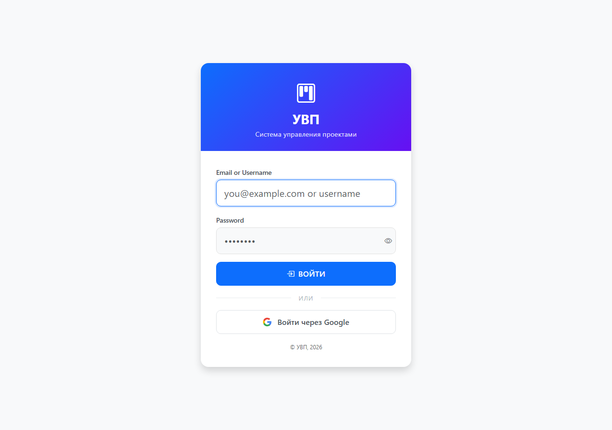

### Список проектов
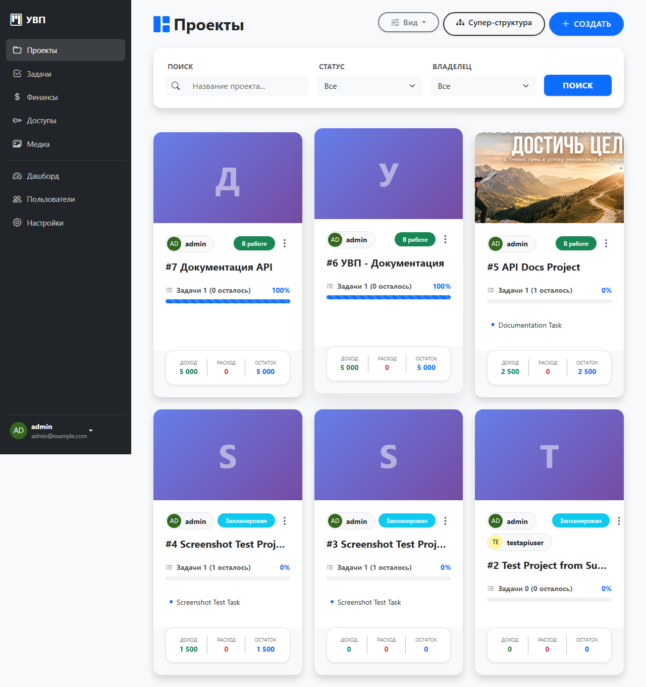

### Супер-структура (глобальная карта проектов)
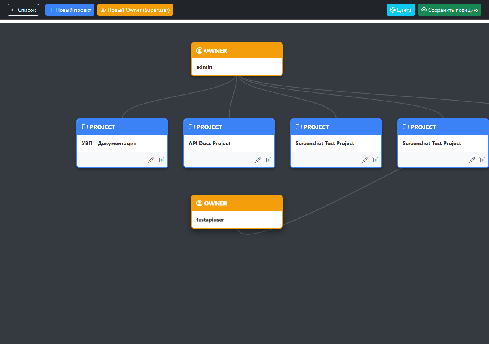

### Детали проекта (вкладки: задачи, финансы, доступы, медиа, структура)
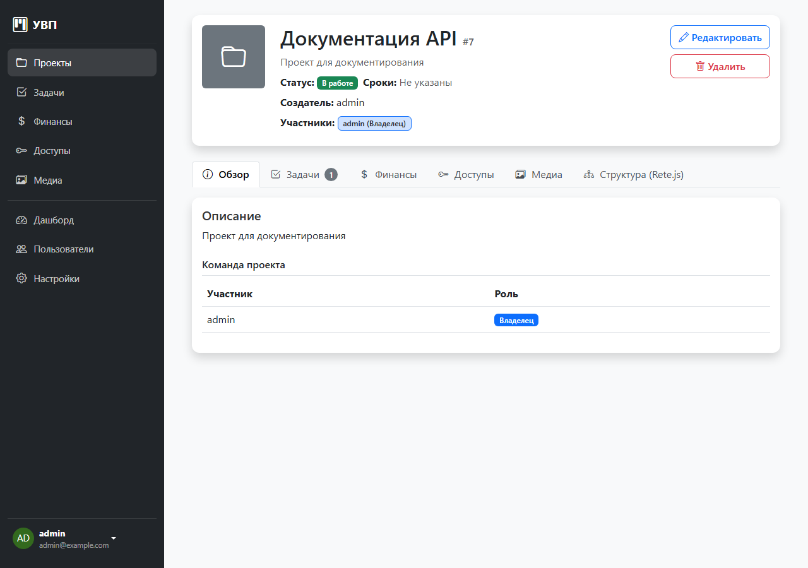

### Структура проекта (интерактивный граф)
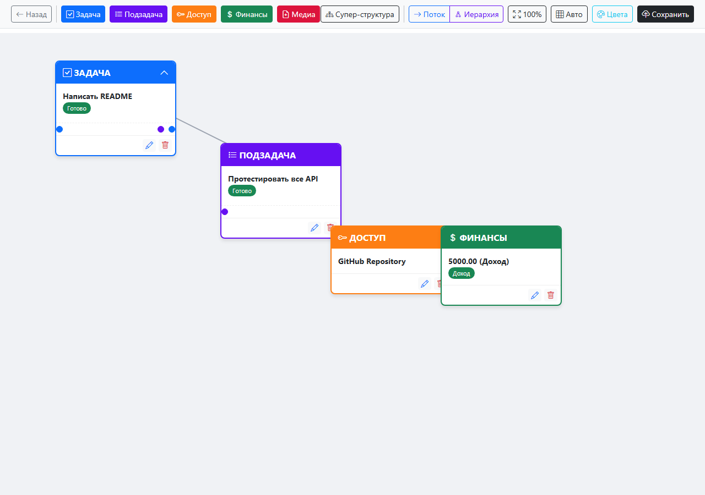

### Дашборд (статистика)
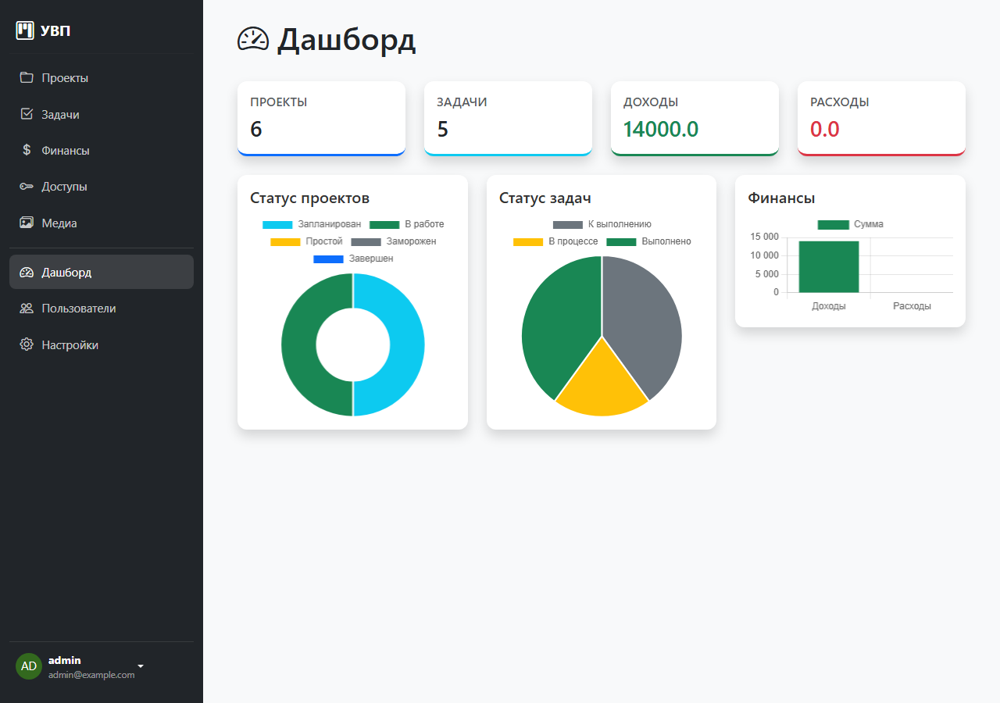

### Задачи
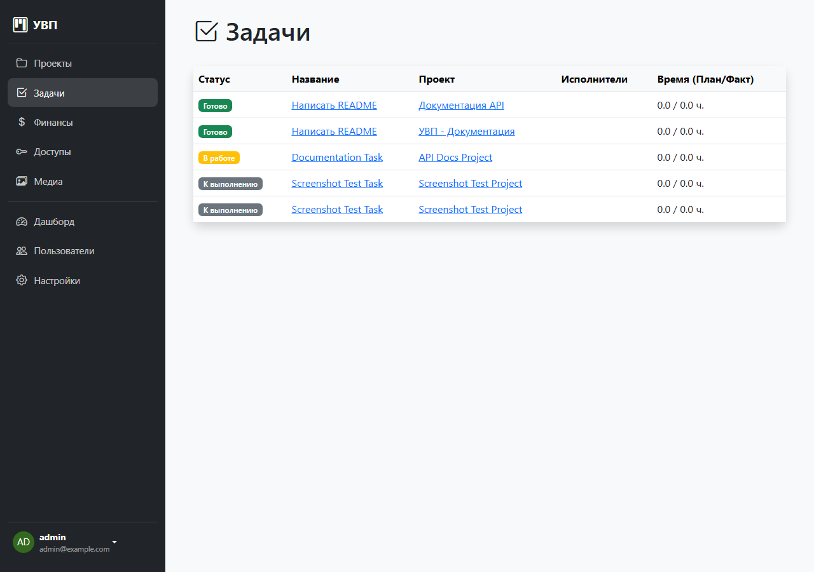

### Финансы (Биллинг)
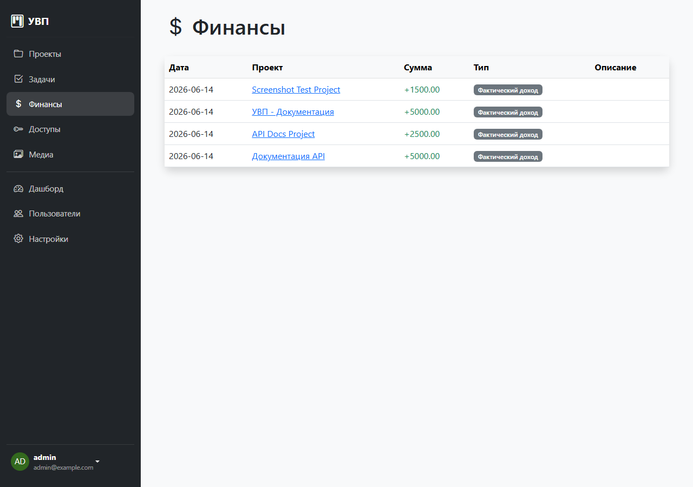

### Доступы
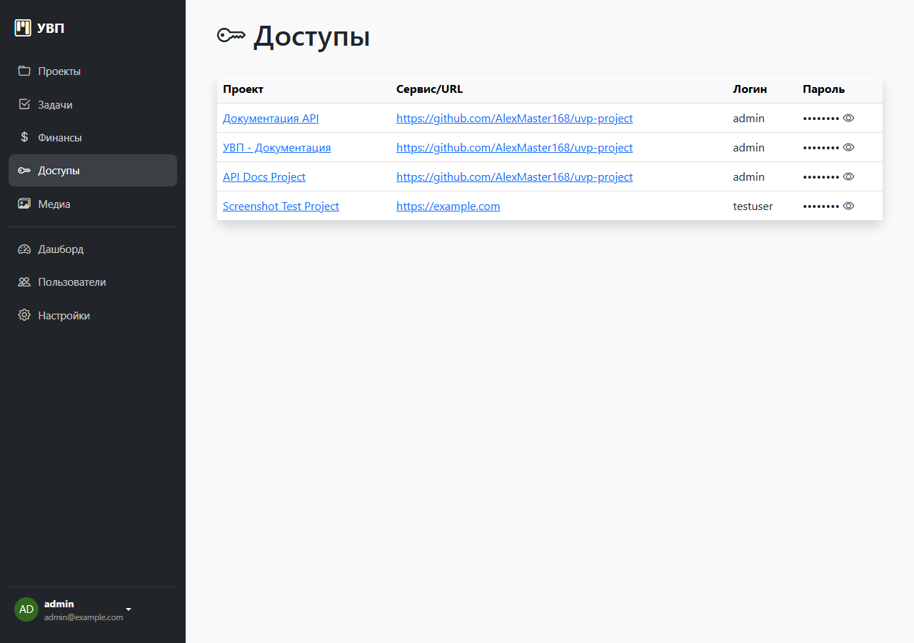

### Медиафайлы
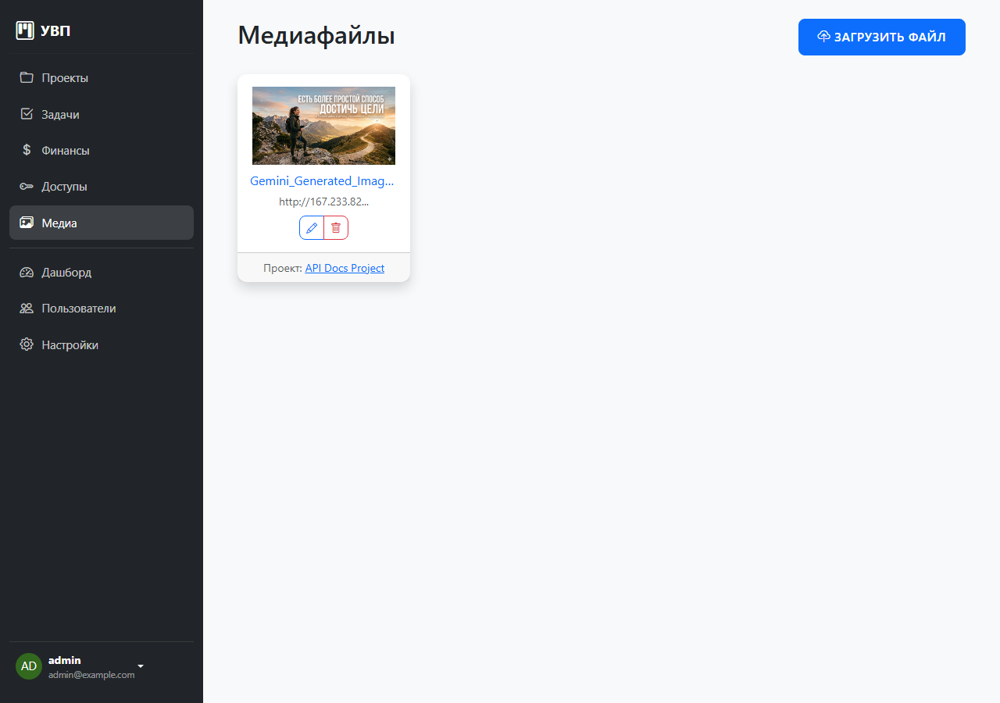

### Админ-панель Django
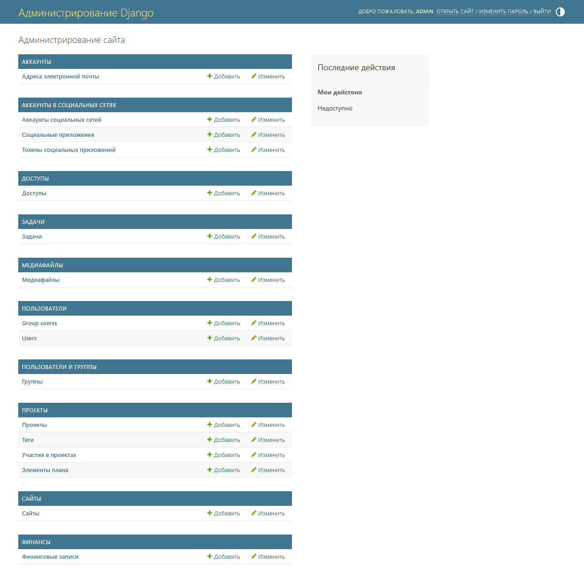

## Схема базы данных

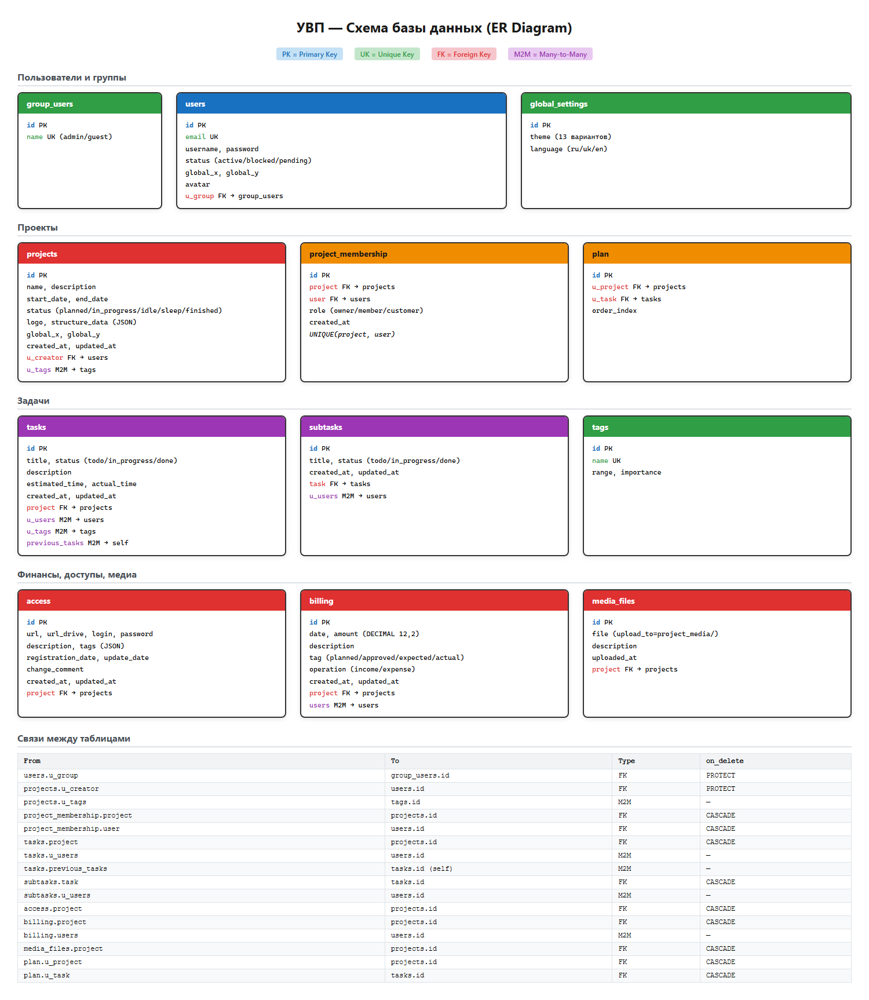

> Интерактивная схема: `docs/db-schema.excalidraw` в [excalidraw.com](https://excalidraw.com)

## REST API

Базовый URL: `http://<host>/api/`

> Все эндпоинты требуют аутентификации (Session Auth + CSRF-токен).

| Модуль | Endpoints | Описание |
|--------|-----------|----------|
| Projects | `GET/POST /api/projects/projects/` | CRUD проектов |
| Projects | `GET/POST /api/projects/projects/super-structure/` | Супер-структура |
| Projects | `GET/POST /api/projects/projects/{id}/structure/` | Структура проекта |
| Tags | `GET/POST /api/projects/tags/` | Управление тегами |
| Users | `GET/POST /api/users/users/` | Пользователи |
| Tasks | `GET/POST /api/tasks/tasks/` | CRUD задач |
| SubTasks | `GET/POST /api/tasks/subtasks/` | CRUD подзадач |
| Billing | `GET/POST /api/billing/billing/` | Транзакции |
| Access | `GET/POST /api/access/access/` | Записи доступов |
| Media | `GET/POST /api/media/media_files/` | Медиафайлы |

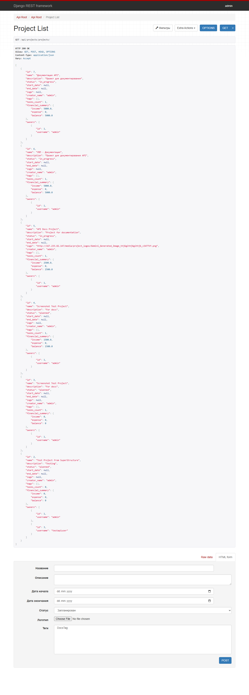

### Примеры

```bash
# Создание проекта
curl -X POST http://host/api/projects/projects/ \
  -H "X-CSRFToken: <token>" \
  -F "name=My Project" -F "status=planned" -F "owner_ids=[1]"

# Создание задачи
curl -X POST http://host/api/tasks/tasks/ \
  -H "X-CSRFToken: <token>" -H "Content-Type: application/json" \
  -d '{"title":"Task","status":"todo","project":1}'

# Создание биллинга
curl -X POST http://host/api/billing/billing/ \
  -H "X-CSRFToken: <token>" -H "Content-Type: application/json" \
  -d '{"project":1,"amount":"1500.00","operation":"income","tag":"actual_income","date":"2026-06-14"}'
```

## Возможности

1. **Проекты** — CRUD, статусы (planned/in_progress/idle/sleep/finished), теги, команды (Owner/Member/Customer)
2. **Задачи/подзадачи** — зависимости (M2M self), время, прогресс
3. **Биллинг** — доходы/расходы по проектам
4. **Доступы** — хранение логинов/паролей с маскировкой
5. **Визуализация** — drag-and-drop граф структуры + супер-структура

## Стек

- **Backend**: Python, Django 5.x, DRF
- **Frontend**: Jinja2, Bootstrap 5, HTMX, Alpine.js
- **БД**: PostgreSQL
- **Деплой**: Docker, Coolify

## Деплой

- **Приложение**: http://167.233.82.147/
- **Coolify**: http://167.233.82.147:8000
- **GitHub**: https://github.com/AlexMaster168/uvp-project

## Документация

- `ARCHITECTURE.md` — архитектура
- `API_DOCUMENTATION.md` — REST API
- `DEPLOYMENT.md` — развёртывание
- `docs/db-schema.png` — схема БД
- `docs/db-schema.excalidraw` — интерактивная схема
- `docs/image/` — скриншоты
